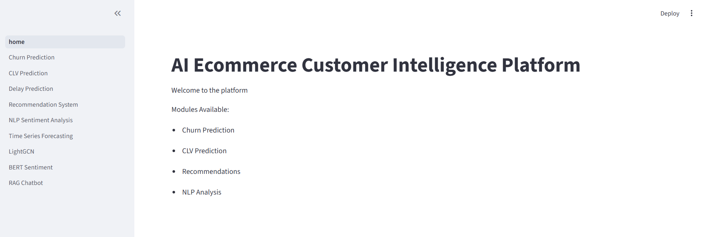
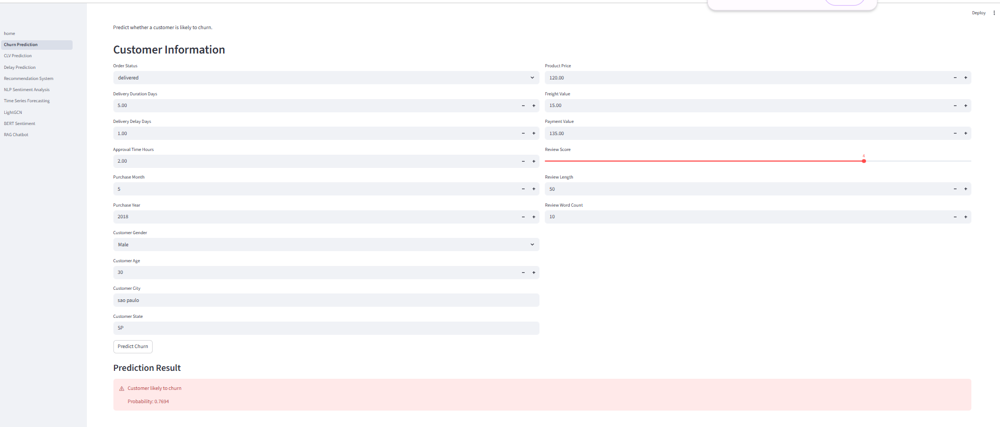
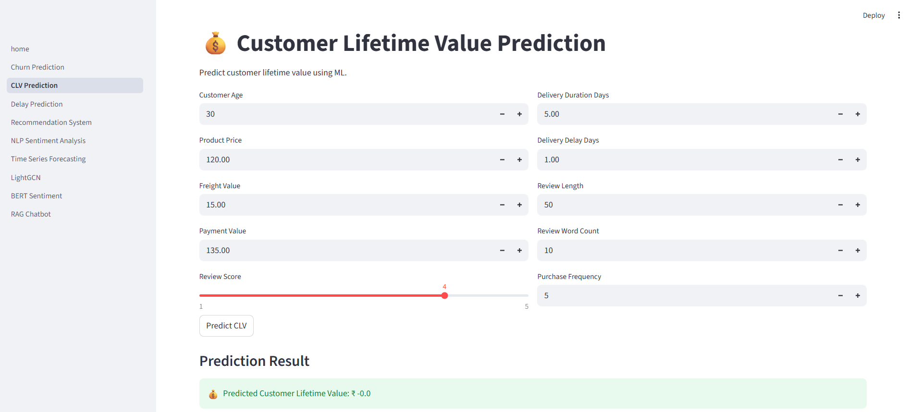
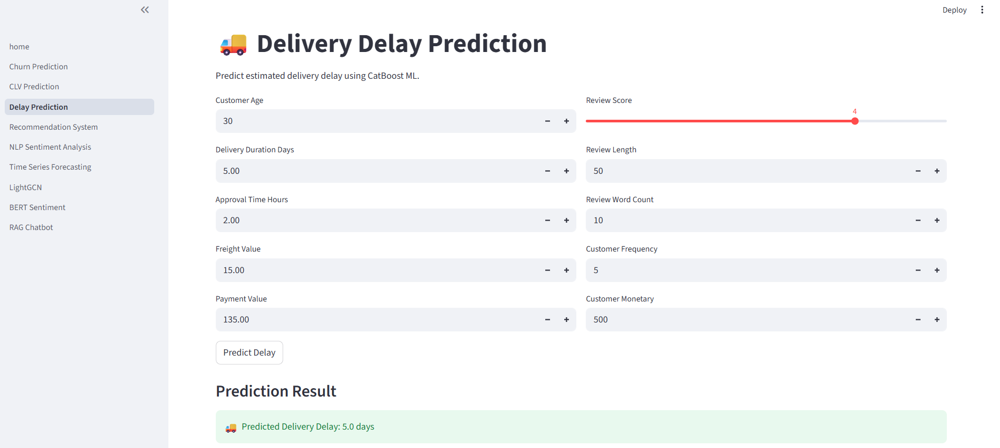
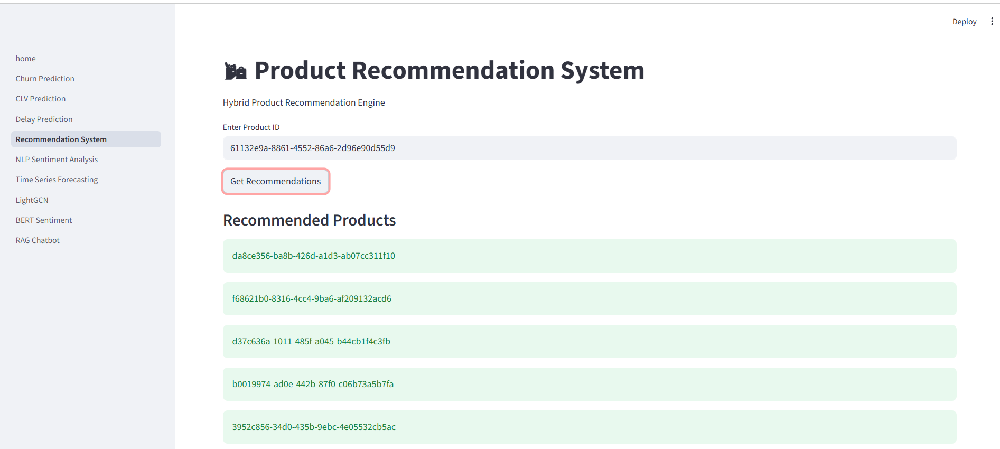
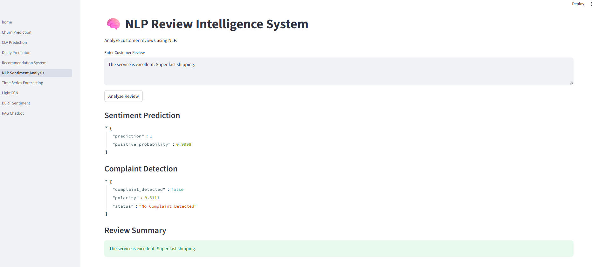
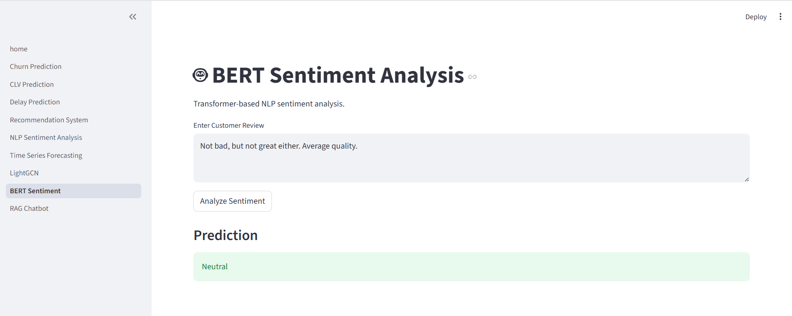
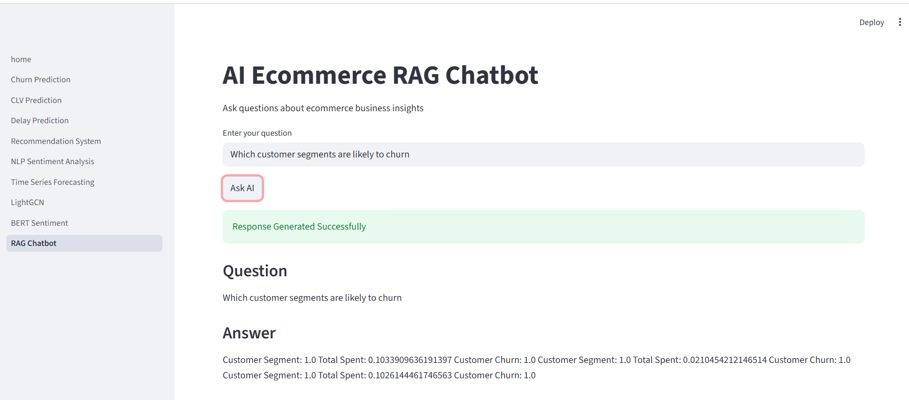
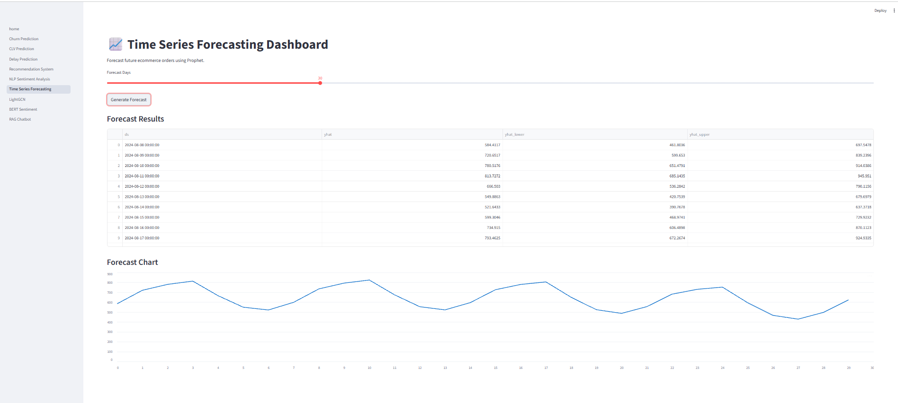
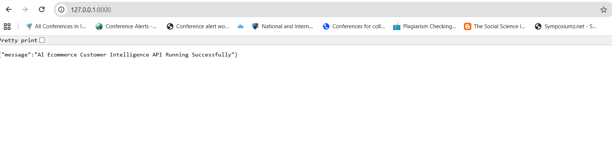

# AI Ecommerce Customer Intelligence Platform


---

# Overview

AI Ecommerce Customer Intelligence Platform is an end-to-end AI-powered analytics and recommendation ecosystem designed for ecommerce business intelligence, customer behavior analysis, NLP-driven insights, forecasting, and intelligent recommendation systems.

This project integrates Machine Learning, Deep Learning, NLP, Recommendation Systems, Forecasting, RAG (Retrieval-Augmented Generation), FastAPI backend services, Streamlit frontend applications, and Dockerized deployment into a single modular production-style platform.

---

# Key Features

## Machine Learning Modules

- Customer Churn Prediction
- Customer Lifetime Value (CLV) Prediction
- Delivery Delay Prediction
- Explainable AI using SHAP

## Recommendation Systems

- Content-Based Recommendation System
- Collaborative Filtering Recommendation System
- Hybrid Recommendation Engine
- LightGCN Deep Learning Recommendations

## NLP & Generative AI

- NLP Sentiment Analysis
- Complaint Detection
- Review Summarization
- Topic Modelling
- Word2Vec Embeddings
- Transformer-based BERT Sentiment Analysis
- GPT-2 Text Summarization

## Forecasting & Time Series

- ARIMA Forecasting
- Prophet Forecasting
- XGBoost Forecasting
- LSTM Forecasting Architecture

## RAG Chatbot

- FAISS Vector Database
- LangChain Integration
- HuggingFace Embeddings
- Ecommerce Knowledge Chatbot

## Frontend & Backend

- Streamlit Multi-Page Application
- FastAPI REST APIs
- Swagger API Documentation
- Dockerized Multi-Service Deployment

---

# Live Demo

Deployment coming soon...

---

# System Architecture

```text
                   ┌──────────────────────┐
                   │    Streamlit UI      │
                   │  Frontend Dashboard  │
                   └──────────┬───────────┘
                              │
                              ▼
                   ┌──────────────────────┐
                   │      FastAPI API     │
                   │  Backend Inference   │
                   └──────────┬───────────┘
                              │
      ┌───────────────────────┼────────────────────────┐
      ▼                       ▼                        ▼
┌─────────────┐      ┌────────────────┐      ┌────────────────┐
│ ML Models   │      │ NLP Pipelines │      │ RAG Chatbot    │
│ Churn/CLV   │      │ BERT/GPT2     │      │ FAISS + LLM    │
└─────────────┘      └────────────────┘      └────────────────┘
      │                       │                        │
      └───────────────────────┼────────────────────────┘
                              ▼
                   ┌──────────────────────┐
                   │    Model Artifacts   │
                   │   Encoders/Weights   │
                   └──────────────────────┘
```

---

# Tech Stack

## Languages & Frameworks

- Python
- Streamlit
- FastAPI
- Docker

## Machine Learning & Deep Learning

- Scikit-learn
- LightGBM
- CatBoost
- XGBoost
- TensorFlow
- PyTorch
- Torch Geometric

## NLP & LLM Stack

- HuggingFace Transformers
- LangChain
- FAISS
- NLTK
- TextBlob
- Word2Vec

## Data & Visualization

- Pandas
- NumPy
- Matplotlib
- Seaborn
- Plotly

---

# Project Structure

```text
AI_Ecommerce_Customer_Intelligence_Platform/
│
├── api/
├── artifacts/
├── assets/
│   └── screenshots/
├── configs/
├── data/
├── notebooks/
├── pipelines/
├── src/
│   ├── components/
│   ├── dl/
│   ├── forecasting/
│   ├── ml/
│   ├── nlp/
│   ├── rag/
│   ├── utils/
│   └── visualization/
│
├── streamlit_app/
├── Dockerfile
├── docker-compose.yml
├── requirements.txt
└── README.md
```

---

# Installation

## Clone Repository

```bash
git clone https://github.com/yourusername/AI_Ecommerce_Customer_Intelligence_Platform.git

cd AI_Ecommerce_Customer_Intelligence_Platform
```

---

# Local Setup

## Create Virtual Environment

### Windows

```bash
python -m venv venv

venv\Scripts\activate
```

### Linux / Mac

```bash
python3 -m venv venv

source venv/bin/activate
```

---

## Install Dependencies

```bash
pip install -r requirements.txt
```

---

# Run Streamlit Application

```bash
streamlit run streamlit_app/home.py
```

Application URL:

```text
http://localhost:8501
```

---

# Run FastAPI Backend

```bash
uvicorn api.app:app --reload
```

API URL:

```text
http://localhost:8000
```

Swagger Documentation:

```text
http://localhost:8000/docs
```

---

# Docker Setup

## Build Containers

```bash
docker compose build
```

## Run Containers

```bash
docker compose up
```

## Docker Services

| Service   | Port |
| ---------- | ---- |
| Streamlit | 8501 |
| FastAPI   | 8000 |

---

# Available Modules

| Module | Description |
|---|---|
| Churn Prediction | Predict customer churn probability |
| CLV Prediction | Estimate customer lifetime value |
| Delay Prediction | Predict delivery delays |
| Recommendation System | Personalized product recommendations |
| NLP Sentiment Analysis | Analyze customer reviews |
| Forecasting | Sales and demand forecasting |
| LightGCN | Graph-based recommendations |
| BERT Sentiment | Transformer-based sentiment analysis |
| RAG Chatbot | Ecommerce business assistant |

---

# API Endpoints

| Endpoint | Method |
|---|---|
| /predict/churn | POST |
| /predict/clv | POST |
| /predict/delay | POST |
| /recommend/products | POST |
| /recommend/lightgcn | POST |
| /nlp/sentiment | POST |
| /nlp/summarize | POST |
| /nlp/complaint | POST |
| /rag/chat | POST |

---

# Application Screenshots

## Home Page



---

## Churn Prediction



---

## CLV Prediction



---

## Delay Prediction



---

## Recommendation System



---

## LightGCN Recommendation


---

## NLP Sentiment Analysis



---

## BERT Sentiment Analysis



---

## RAG Chatbot



---

## Time Series Forecasting



---

## Swagger API Docs


---

## Docker Running Containers


---

## API Calls



---

# Future Improvements

- CI/CD Pipeline Integration
- Cloud Deployment on AWS/GCP/Azure
- Kubernetes Orchestration
- Model Monitoring & Observability
- MLflow Integration
- Advanced LLMOps Pipeline
- Real-Time Streaming Analytics
- User Authentication & RBAC

---

# Learning Outcomes

This project demonstrates:

- End-to-End AI Application Development
- Production-Style ML Engineering
- Deep Learning Model Integration
- NLP & LLM System Design
- Recommendation System Engineering
- API Development with FastAPI
- Dockerized Deployment
- Modular Software Architecture
- RAG Pipeline Development

---
# Dataset Acknowledgment

Datasets used in this project are sourced from publicly available ecommerce and Kaggle datasets for educational and portfolio purposes.

---

# Author

Niranjana Thirumaraiselvan

---

# License

This project is licensed under the MIT License.